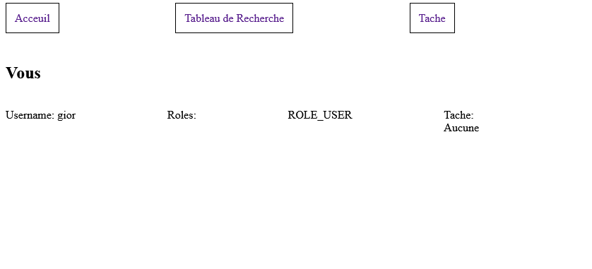
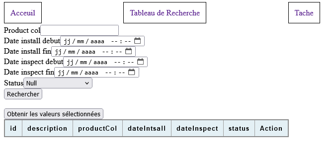
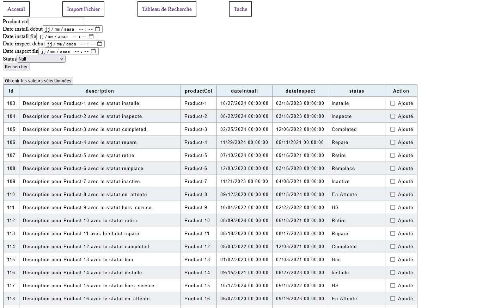
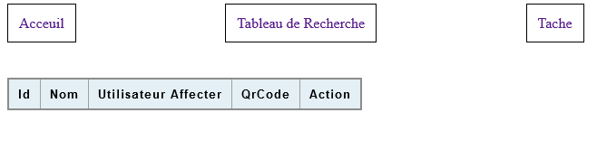
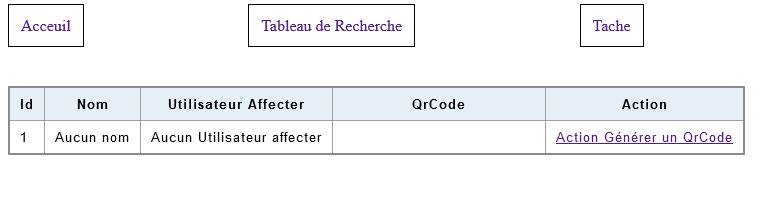
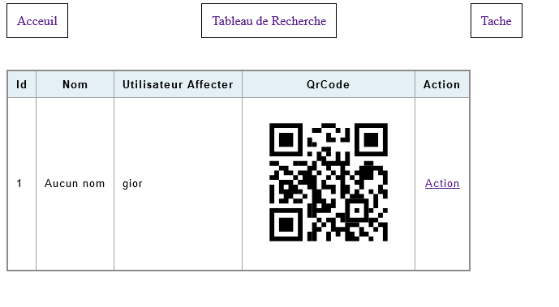
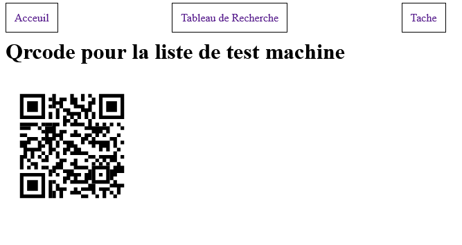

## Installation des nécessaires

### Docker network

```bash
docker network create app
```

### Passer en HTTPS de force en local (optionnel)

> Le container doit déjà être allumé.

1. Se connecter au container (en root) :

```bash
docker compose exec -itu root app bash
```

2. Exécuter l'URL donnée dans la documentation Symfony :

```bash
curl -sS https://get.symfony.com/cli/installer | bash
```

3. Installer Symfony et configurer l'alias dans le bash, ainsi que forcer le HTTPS dans Symfony 6 :

```bash
export PATH="$HOME/.symfony5/bin:$PATH" # mettre dans la path de l'utilisateur (en local et non enregistrer)
symfony server:ca:install
```

### Configurer le container pour l'allumer

La configuration se fait en deux étapes :

- Modifier le fichier [`.env`](docker/.env)
- Construire l'image située dans le dossier [`$pwd\GestionnaireStockMat-rielNucl-aire\docker\web`](docker/web/Dockerfile) (optionnel, car cela se fait automatiquement au démarrage).

Une fois allumé, il faut effectuer la migration de la base de données :

```bash
bin/console doctrine:migrations:migrate # il faudra accepter en ecrivant 'yes'
```

Après la migration, accéder à la route suivante :

```url
http://hostname/init # hostname => ip ou domaine ou il y a docker
```

Une fois terminé, vous pouvez vous connecter avec les comptes suivants :

- Utilisateur :
    Nom d'utilisateur : gior
    Mot de passe : gior
    Droit : USER

- Administrateur :
    Nom d'utilisateur : admin
    Mot de passe : admin
    Droit : USER et ADMIN

Vous serez alors connecté à l'un des deux comptes.

## Affichage

<details>
<summary>Les Vues Utilisateur</summary>

### Page d'accueil utilisateur
<figure>
    
    <figcaption>Contient les informations de l'utilisateur, ses tâches et un menu.</figcaption>
</figure>
</details>
<details>
    <summary>Les Vues Administrateur</summary>

### Page d'accueil administrateur
<figure>
    
    <figcaption>Informations de l'utilisateur, tâches, menu, et possibilité de créer des utilisateurs avec un ou deux rôles.</figcaption>
</figure>
</details>
<details>
<summary>Vues pour tous les rôles</summary>

### Table de recherche vide

<figure>  </figure>

### Table de recherche remplie

<figure>  </figure>

### Liste des tâches non remplies

<figure>  </figure>

### Liste des tâches remplies

<figure>  </figure>

### Liste des tâches remplies avec QR Code

<figure>  </figure>

### QR Code pour partager la liste des tâches

<figure>  </figure>
</details>

## Rendu ou Présentation

1. Symfony utilise Twig pour le format web. Les templates se trouvent principalement dans le dossier `templates`. Comme pour d'autres frameworks, il est possible d'étendre un template existant. [exemple d'extion](https://github.com/Giovanniricotta2002/GestionnaireStockMat-rielNucl-aire/blob/main/templates/recherche/index.html.twig#L1).
2. Symfony intègre le support des `CSRF tockens`. Voici des exemples d'utilisation : [dans un template](https://github.com/Giovanniricotta2002/GestionnaireStockMat-rielNucl-aire/blob/main/templates/security/login.html.twig#L22C9-L24C10) et [dans le backend](https://github.com/Giovanniricotta2002/GestionnaireStockMat-rielNucl-aire/blob/main/src/Controller/SecurityController.php#L28).
3. Par défaut, Symfony est configuré pour l'API. Il est nécessaire de spécifier les méthodes HTTP autres que `GET` dans les contrôleurs : Exemple avec [GET](https://github.com/Giovanniricotta2002/GestionnaireStockMat-rielNucl-aire/blob/main/src/Controller/AcceuilController.php#L37C1-L46C6) et Exemple avec [POST](https://github.com/Giovanniricotta2002/GestionnaireStockMat-rielNucl-aire/blob/main/src/Controller/TaskController.php#L80C1-L96C6).
4. Symfony peut être connecté à une base de données grâce à la bibliothèque [*Doctrine*](https://www.doctrine-project.org/projects/doctrine-dbal/en/latest/reference/configuration.html#connecting-using-a-url). La connexion se fait automatiquement si l'[URL de connexion](https://github.com/Giovanniricotta2002/GestionnaireStockMat-rielNucl-aire/blob/main/.env#L29) est fournie. Il est possible de connecter plusieurs bases, mais cela nécessite une configuration supplémentaire dans le fichier [config/packages/doctrine.yml](https://github.com/Giovanniricotta2002/GestionnaireStockMat-rielNucl-aire/blob/main/config/packages/doctrine.yaml).
5. Pour déployer l'application, se référer aux instructions ci-dessus.
